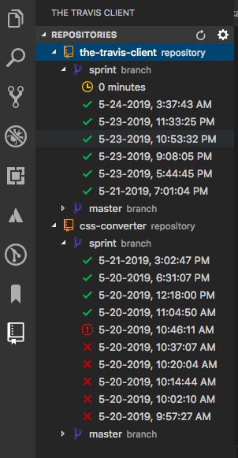
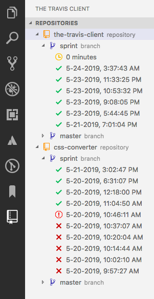
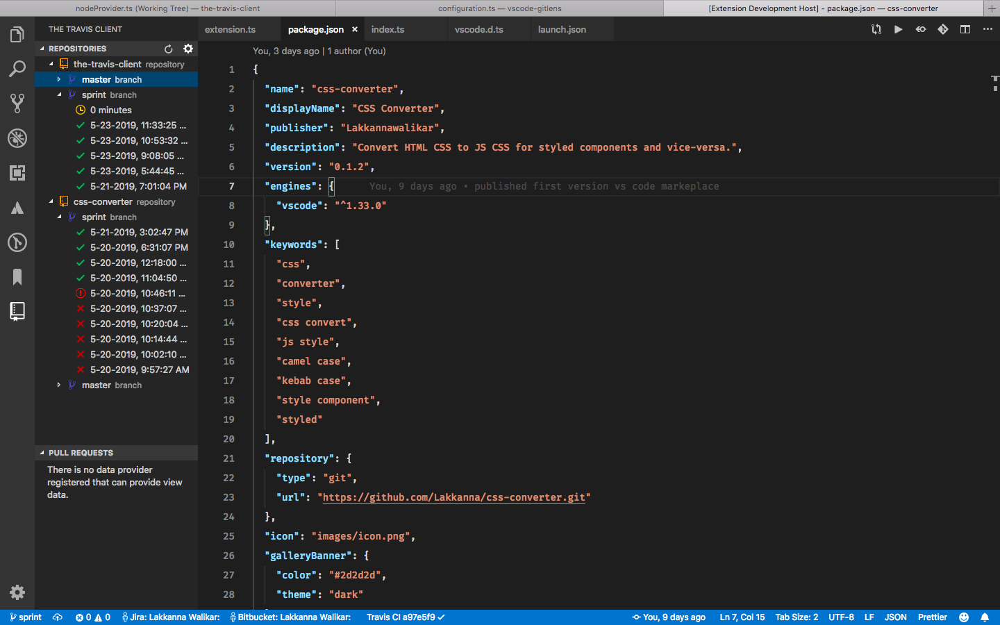

# The Travis Client

[](https://marketplace.visualstudio.com/items?itemName=lakkanna.the-travis-client)
[](https://marketplace.visualstudio.com/items?itemName=Lakkannawalikar.the-travis-client)
[](https://marketplace.visualstudio.com/items?itemName=Lakkannawalikar.the-travis-client)


Extension to interact with travis build status.

### If you like 👍 give stars ⭐️ in [Github](https://github.com/Lakkanna/the-travis-client) and [VS Code Marketplace](https://marketplace.visualstudio.com/items?itemName=Lakkannawalikar.the-travis-client&ssr=false#review-details).

## Features

Lists last 10 builds for each branch for all repositories you own or organization, the build status is shown using icon.

 

## Requirements

- Account should be there in travis-ci account and `api-token`.
  - [Travis-CI api-token](https://travis-ci.org/account/preferences) -> settings --> COPY TOKEN
- Repositories should be active for builds in travis-ci.
- Owner or Orgonization name for the repositories.

## Extension Settings

Extension requires four settings

- **owner/organization name** _(mandatory)_
- **api-token** _(mandatory)_: this you will find in travis account settings,
- **branches** _(optional)_ if you not added branches it show status for all branches.
- **interval** _(optional)_ for auto refersh (defautl 5 minutes)

Copy **api-token**, you need it once after installing extension, you'll see pop-up paste there.

**_Note_**: By miss if you missed pasting api-token, you can add it again by clicking on **_..._** icon which shows on REPOSITORIES title or you can run using command pallette `Shift + CMD + P` -> search for `Travis Client: Set <Community/Enterprise> Token` and hit enter.

## API-Token setup

- **Travis Enterprise**

  - `(Shift + CMD + P)` search `>Travis Client: Set Enterprise Token` and hit enter, `Paste Travis Enterprise api-token` in input field.

- **Travis Community**
  - `(Shift + CMD + P)` search `>Travis Client: Set Community Token` and hit enter, `Paste Travis Community api-token` in input field.

This extension contributes the following settings:

- `travisClient.owner`: owner name or organization name, (_It's not github email id_).

  - `owner`: Name in travis account

- `travisClient.branches`: want's to see only these branches build status, default it'll show all branches
- `travisClient.pro`: enables travis enterprise mode, which need to private repositories, for enterprise mode you need enterprise [api token](https://travis-ci.com/account/preferences) .
  default value for this is false.

- `travisClient.interval`: time interval for auto refresh data. interval in minuts _(default: 5 minutes)_

For example:

  ```json
    "travisClient.owner": "lakkanna",
    "travisClient.branches": ["master", "sprint"],
    "travisClient.pro": true,
    "travisClient.interval": 6
  ```

### Note: If `travisClient.pro` is enabled, should add enterprise api-token.

### `If you have any questions feel free to shoot an email: ` lakkannawalikar@gmail.com

## Release Notes

### 0.0.1
- Get all repositories from https://travis-ci.org
- Get branches for all repositories
- Get build status for all branches

### 0.0.2
- Added Keywords in package.json

### 0.0.3
- Added Travis Enterprise account (for private repository access)

### 0.0.4
- Check is travis project
- Auto refresh on configuration changes in **settings.json**
- Reasonable error messages

### 0.0.5
- Added status bar item to show active repositories, active branch last build status

### 0.0.6
- Fixed activation events

### 0.0.7
- Fixed extension activation problem

### 0.0.8
- Added auto refresh, refresh after time interval _(unit: minutes)_, default interval is 5 minutes

### 0.0.9
- Updated devDependencies reason _(axios)_ vulnerability.

### 0.1.0
- Added individual build *Restart* and build *Cancel*

---


